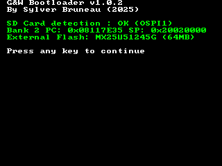
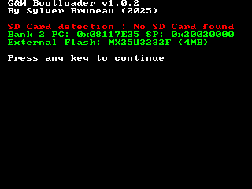

# game-and-watch-bootloader
Game & Watch Bootloader is an application designed to allow easy installation/update of application on Game & Watch devices.

This allows updating Retro-Go simply by loading and running an update package from the SD card.

It is a major part of the Game & Watch [Retro-Go SD](https://github.com/sylverb/game-and-watch-retro-go-sd) project as it allows users to easily install or update [Retro-Go SD](https://github.com/sylverb/game-and-watch-retro-go-sd)

# Installation

## Requirements
To install the bootloader on your Game & Watch, you need a JTAG adapter (such as an ST-Link v2).

You'll need the [gnwmanager](https://github.com/BrianPugh/gnwmanager) application to flash the bootloader onto your console.

## Flashing the bootloader
### By compiling the project
```
git clone --recurse-submodules https://github.com/sylverb/game-and-watch-bootloader
make flash
```
### By flashing released version
[GnWManager](https://github.com/BrianPugh/gnwmanager) has official support for this firmware.
The following command will download the latest version of `game-and-watch-bootloader` and flash it:
```
gnwmanager flash-bootloader bank1 -- start bank1
```

Alternatively, you can manually download the latest released version [here](https://github.com/sylverb/game-and-watch-bootloader/releases/).
Flash the binary to the internal flash of the Game & Watch using [gnwmanager](https://github.com/BrianPugh/gnwmanager):
```
gnwmanager flash bank1 gnw_bootloader.bin -- start bank1
```


# How to use
A diagnostic menu is available if you keep "GAME" button pressed when turning on the Game & Watch.

Available information are :
- Bootloader version
- SD Card status : found or not, and SD mod type (SPI1 or OSPI1)
- Internal flash bank 2 status (valid or not)
- External flash model and size

 

If no button is pressed, bootloader will automatically run firmware updater or Retro-Go.

# Limitations
Currently, this bootloader is not compatible with dual boot (i.e., having both the original firmware and Retro-Go).

# Technical info
## How it works
The flowchart for the application is the following :
```mermaid
graph TD
    A[Start Bootloader] --> B[Detect SD Card]
    B --> C{SD Card Found?}
    C -->|Yes| D[Load Firmware Update File to RAM]
    C -->|No| E[Boot Bank 2]
    D --> F{File Loaded Successfully? /retro-go_update.bin}
    F -->|Yes| G[Unmount SD Card and Deinit]
    G --> H[Boot from RAM]
    F -->|No| E
    H --> I[Execute Firmware from RAM]
    E --> J{Is Bank 2 Valid?}
    J -->|Yes| K[Boot from Bank 2]
    J -->|No| L[Wait 60 Seconds]
    L --> M[Enter Deep Sleep]
    K --> N[Execute Firmware from Bank 2]
```

## Update archive format
/retro-go_update.bin must be an executable application built to run from RAM (@0x24000000).
Two cases are handled:
- If the file is 1MB or smaller, it is loaded into RAM, and the bootloader starts the loaded application.
- If the file is larger than 1MB, its contents follow this structure:

| Application Binary (1024 KB)  | Binary Length (4 Bytes) | Payload (Remaining) |
| ----------------------------- | ----------------------- | ------------------- |


The advantage of this format is that it combines the firmware update application and the firmware binary into a single file, simplifying the update process for users.
